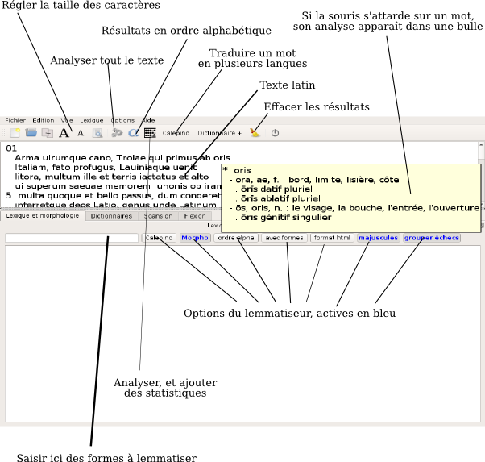

*Collatinus 11 -- guide*

Précédent : [index](index.html) suivant : [Pour débuter](debuter.html)

Fenêtres, éditeurs et boutons 
=============================

Voici une vue générale de l'interface de Collatinus :

Les onglets de la partie inférieure peuvent être
déplacés et redimensionnés :

Une description complète de l'utilisation des dictionnaires est donnée
au chapitre [dictionnaires](dictionnaires.html).

Précédent : [index](index.html) suivant : [Pour débuter](debuter.html)
