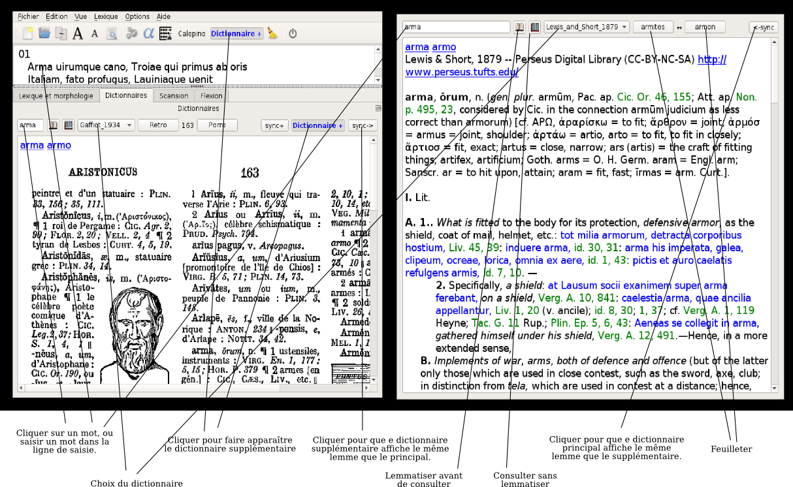

*Collatinus 11 -- guide*

[index](index.html) précédent : [Lemmatiser et analyser](lemmatiser.html) suivant : [Scander](scander.html) 

Dictionnaires
=============

Cette copie annotée de Collatinus montre comment piloter les dictionnaires :

Et voici un résumé des commandes :

1. Choix du dictionnaire dans un menu déroulant ;
2. Sélection du mot à chercher soit en cliquant dans le texte latin,
	soit en saisissant le mot dans la ligne de saisie à gauche
    (dans ce dernier cas, on peut chercher la forme exacte, 
    sans lemmatisation, en cliquant sur l'icone représentant
    une page unique) ;
3. Feuilleter le dictionnaire (page précédente, page suivante,
   pour les dictionnaires en mode image ; 
   articles précédent et suivant pour les dictionnaires numériques) ;
4. Ajouter une fenêtre de dictionnaire (le même, ou un différent).
	Le même bouton permet de fermer le dictionnaire supplémentaire ;
5. Demander l'affichage du même mot dans les deux dictionnaires,
   systématiquement (en activant le bouton **sync+**) ou
   ponctuellement (en appuyant sur un des boutons **sync->**
   ou **<-sync**, selon la fenêtre active).

[index](index.html) précédent : [Lemmatiser et analyser](lemmatiser.html) suivant : [Scander](scander.html) 
