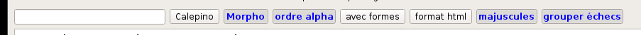

*Collatinus 11 -- guide*

[index](index.html) précédent : [Pour débuter](debuter.html) suivant : [Dictionnaires](dictionnaires.html) 

Lemmatiser et analyser
======================

Beaucoup plus qu'un mot français, un mot latin peut
prendre de nombreuses apparences. Chacune de ces
apparences est appelée _forme_.

Pour apprendre le latin, il faut donc savoir, quand on
a lu une forme, la _lemmatiser_, c'est à dire savoir
quel mot a pu donner cette forme, et souvent même,
quels mots ont pu la donner.

Lemmatiser ne suffit pas. Il faut aussi savoir _analyser_
une forme, c'est à dire la raison pour laquelle on a
employé cette forme du mot (qu'on appelle alors
_lemme_) plutôt qu'une autre. Attention, il s'agit là
de l'analyse _morphologique_, qui ne suffit pas pour
lire le latin. Il faut aussi connaître la _syntaxe_ de
la langue.

Collatinus essaie donc de lemmatiser les mots d'un
texte, et aussi de donner leur analyse morphologique.
En cliquant sur un mot du texte (fenêtre supérieure),
on obtient sa lemmatisation dans la fenêtre du bas.
Pour lemmatiser l'ensemble du texte, on peut cliquer
sur l'icone représentant des engrenages, ou sur celle
portant un &alpha; (pour forcer l'ordre alphabétique, 
sans tenir compte de l'option sélectionnée, cf. ci-dessous).
Le raccourci **Ctrl-L** conduit au même résultat que
les engrenages.
La lemmatisation d'un texte permet aussi de le
[coloriser](coloriser.html).

L'onglet de lemmatisation de l'application fournit de
nombreuses options, données par cette image. Une option
activée est en bleu. Un clic sur le bouton active ou
désactive l'option.

De gauche à droite :

1. **Une ligne de saisie**, qui permet de lemmatiser tout ce qu'elle
   contient sans modifier le texte latin chargé dans la partie supérieure.
   On y place du texte, et on appuie sur la touche **Entrée**.
2. **Calepino** : Si l'option est activée, les lemmes sont traduits dans
   toutes les langues cibles disponibles.
3. **Morpho** : permet d'afficher toutes les analyses
   morphologiques possibles de la forme.
4. **ordre alpha** : range les lemmes par ordre alphabétique si elle est
   activée, sinon dans l'ordre d'apparition dans le texte.
5. **avec formes** : chaque lemmatisation est précédée de la forme telle
   qu'elle apparaît dans le texte.
6. **format html** : permet une meilleure présentation visuelle, mais 
   ralentit l'affichage des textes longs.
7. **majuscules** : essaie de tenir compte des majuscules, et permet de 
	faire la distinction entre noms propres et communs ou adjectifs.
	L'ambiguïté demeure lorsque la forme est en début de phrase.
8. **grouper échecs** : Si l'option est activée, tous les mots dont 
    la lemmatisation a échoué sont rassemblés à la fin
	des résultats. Sinon, ils sont à leur place dans le
	texte (ou dans l'ordre alphabétique), avec une mention d'échec.

[index](index.html) précédent : [Pour débuter](debuter.html) suivant : [Dictionnaires](dictionnaires.html) 
